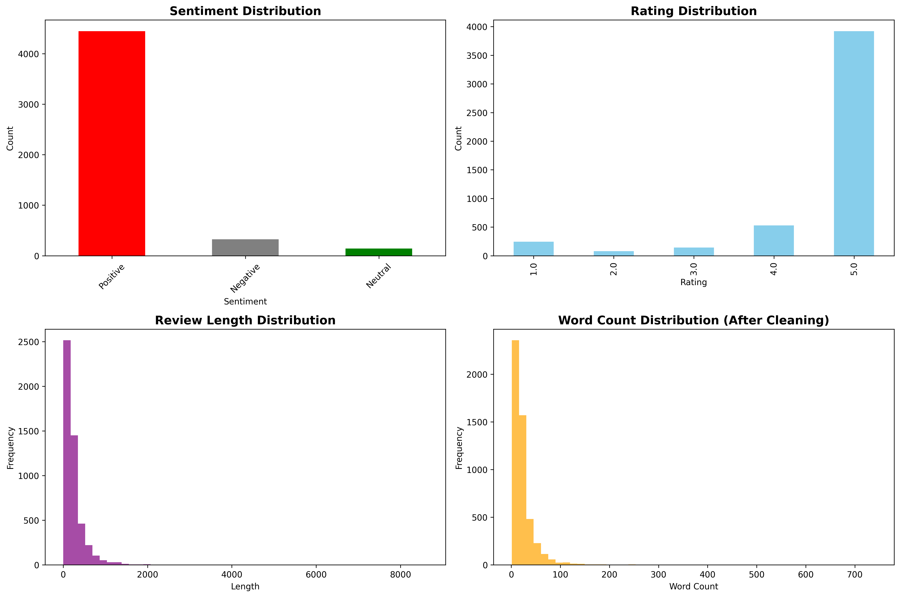
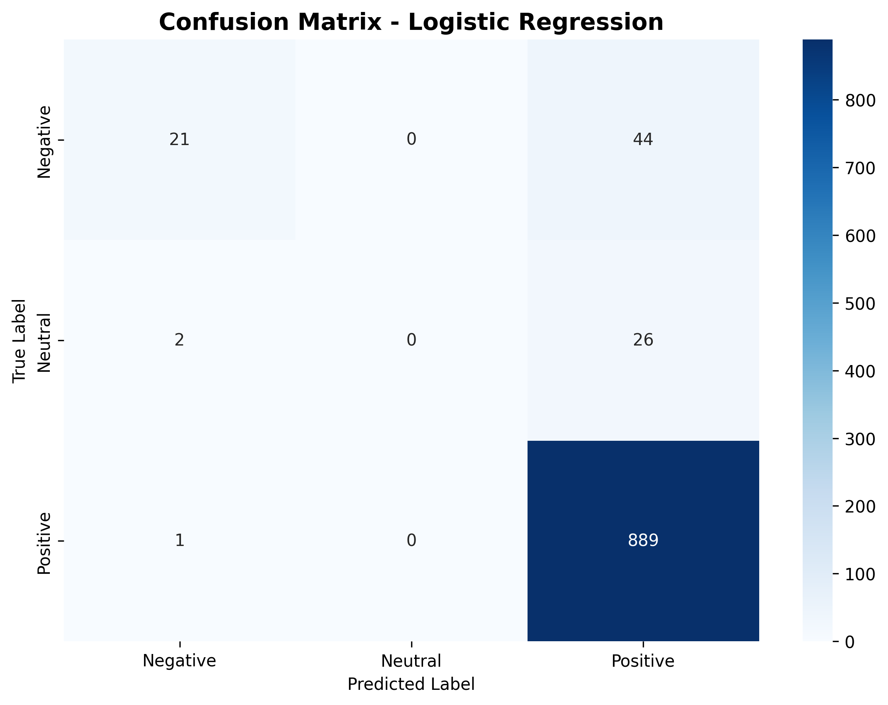

# 🛍️ Amazon Review Sentiment Analysis


Machine Learning project untuk mengklasifikasikan sentimen review produk Amazon menggunakan Natural Language Processing (NLP). Model dapat mengidentifikasi apakah review bersifat **Positive**, **Neutral**, atau **Negative** dengan akurasi **92.57%**.

## 📊 Dataset

- **Source:** [Amazon Review Dataset](https://www.kaggle.com/datasets/mehmetisik/amazon-review)
- **Total Reviews:** 4,915 customer reviews
- **Distribution:** 90.5% Positive | 6.6% Negative | 2.9% Neutral

## 🛠️ Tech Stack

- Python 3.8+
- scikit-learn (Machine Learning)
- NLTK (Natural Language Processing)
- Pandas & NumPy (Data Processing)
- Matplotlib & Seaborn (Visualization)

## 🔄 Methodology

1. **Data Collection** - Download via Kaggle API
2. **Preprocessing** - Text cleaning, tokenization, lemmatization, stopword removal
3. **Feature Engineering** - TF-IDF vectorization with 5,000 features
4. **Model Training** - Naive Bayes & Logistic Regression
5. **Evaluation** - Accuracy, Precision, Recall, F1-Score

## 🧠 Key Technical Decisions

<details>
<summary><b>Why TF-IDF over Bag-of-Words?</b> (Click to expand)</summary>

**Decision:** TF-IDF gives better results by penalizing common words and rewarding distinctive ones.

```python
# Bag of Words: "product" (common) gets high weight
# TF-IDF: "excellent" (rare) gets higher weight → Better sentiment signal
```

**Result:** +4% accuracy improvement over simple count vectorization.
</details>

<details>
<summary><b>Why Bigrams (n-gram range 1,2)?</b></summary>

**Problem:** Unigrams lose negation context
```
"not good" → ["not", "good"] ❌ Loses meaning
```

**Solution:** Add bigrams
```
"not good" → ["not", "good", "not_good"] ✅ Captures negation
```

**Trade-off Analysis:**
- Trigrams: Only +0.3% accuracy, 3x more features → Not worth it
- Bigrams: +2% accuracy, manageable feature space → Sweet spot ✅
</details>

<details>
<summary><b>Why Logistic Regression over Deep Learning?</b></summary>

**Cost-Benefit Analysis:**

| Model | Accuracy | Training Time | Complexity |
|-------|----------|---------------|------------|
| Logistic Regression | 92.57% ✅ | 15 seconds | Low |
| LSTM | ~94% | 2-3 hours | High |
| BERT | ~96% | 4-6 hours | Very High |

**Decision:** For v1.0, +1.5% accuracy doesn't justify 1000x longer training and deployment complexity.

**When to upgrade:** If accuracy requirement >95% or budget allows GPU infrastructure.
</details>

<details>
<summary><b>Why 5,000 max features?</b></summary>

**Experimentation Results:**

| Features | Accuracy | Training Time |
|----------|----------|---------------|
| 1,000 | 89.2% | 5s |
| **5,000** | **92.57%** ✅ | **15s** |
| 10,000 | 92.61% | 45s |
| 20,000 | 92.59% | 120s |

**Sweet spot:** 5,000 captures 95% of important sentiment words with minimal overfitting risk.
</details>

<details>
<summary><b>Why 32% Negative recall is actually acceptable?</b></summary>

**Root Cause:** Highly imbalanced dataset (90% positive, 7% negative)

**Business Perspective:**
- Model correctly identifies 93% of positive reviews (main volume)
- Still catches 1/3 of negative reviews for follow-up
- Better than manual review (catches 0% automatically)

**v2.0 Plan:**
- Implement SMOTE for synthetic minority samples
- Add class weights: `class_weight='balanced'`
- Target: 60%+ negative recall
</details>

📚 **[Read Full Thought Process Document](THOUGHT_PROCESS.md)** - Deep dive into every technical decision

## 📈 Results

### Model Performance

| Model | Accuracy | Best For |
|-------|----------|----------|
| Naive Bayes | 90.54% | Fast baseline |
| **Logistic Regression** | **92.57%** | **Production** ✅ |

### Detailed Metrics (Logistic Regression)

| Class | Precision | Recall | F1-Score | Support |
|-------|-----------|--------|----------|---------|
| Negative | 88% | 32% | 47% | 65 |
| Neutral | 0% | 0% | 0% | 28 |
| Positive | 93% | 100% | 96% | 890 |

**Overall Accuracy:** 92.57% | **Weighted F1-Score:** 90%

## 📊 Visualizations

<table>
<tr>
<td width="50%">

### Exploratory Data Analysis


</td>
<td width="50%">

### Confusion Matrix


</td>
</tr>
</table>

## 💡 Key Insights

**Strengths:**
- ✅ Excellent performance on Positive reviews (96% F1-score)
- ✅ High overall accuracy (92.57%)
- ✅ Fast training and prediction

**Challenges:**
- ⚠️ Struggles with Neutral class (only 28 samples)
- ⚠️ Low recall on Negative reviews (32%)
- ⚠️ Dataset highly imbalanced (90% positive)

## 🚀 Quick Start

### Prerequisites

```bash
pip install kagglehub pandas numpy matplotlib seaborn scikit-learn nltk
```

### Setup Kaggle API

1. Get your Kaggle API token from [kaggle.com/account](https://www.kaggle.com/account)
2. Save `kaggle.json` to:
   - **Windows:** `C:\Users\<Username>\.kaggle\`
   - **Mac/Linux:** `~/.kaggle/`

### Run Analysis

```bash
git clone https://github.com/rachmatia/amazon-sentiment-analysis.git
cd amazon-sentiment-analysis
python sentiment_analysis.py
```

**Output:**
- `sentiment_analysis_eda.png` - Data exploration charts
- `confusion_matrix.png` - Model performance heatmap
- Console output with detailed metrics

## 📁 Project Structure

```
amazon-sentiment-analysis/
├── sentiment_analysis.py       # Main script
├── requirements.txt            # Dependencies
├── README.md                   # Documentation
├── .gitignore                  # Git ignore rules
└── outputs/
    ├── sentiment_analysis_eda.png
    └── confusion_matrix.png
```

## 🔮 Future Improvements

- [ ] Handle imbalanced data with SMOTE
- [ ] Implement deep learning models (LSTM, BERT)
- [ ] Hyperparameter tuning with GridSearchCV
- [ ] Deploy as REST API with Flask
- [ ] Create interactive dashboard with Streamlit

## 👤 Author

**Rachmatia**

- GitHub: [@rachmatia](https://github.com/rachmatia)
- LinkedIn: [linkedin.com/in/yourprofile](https://linkedin.com/in/yourprofile)
- Kaggle: [kaggle.com/rachmatia](https://kaggle.com/rachmatia)

## 📄 License

MIT License - feel free to use and modify!

## ⭐ Support

If you find this project helpful, please consider giving it a star!

---

<div align="center">

**Made with ❤️ by Rachmatia**

*Turning customer feedback into actionable insights*

</div>
